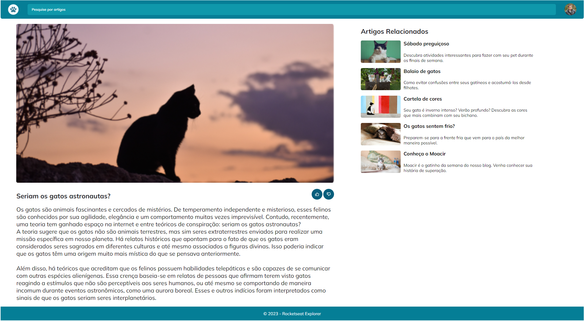

<h1 align="center"> Cosmo Felino </h1>

O Cosmo Felino é uma aplicação proposta pela RocketSeat no programa de formação FULLSTACK EXPLORER e desenvolvida por mim, Juliano Mariano.  

  <a href="#-tecnologias">Tecnologias</a>&nbsp;&nbsp;&nbsp;|&nbsp;&nbsp;&nbsp;
  <a href="#-projeto">Projeto</a>&nbsp;&nbsp;&nbsp;|&nbsp;&nbsp;&nbsp;
  <a href="#-layout">Layout</a>&nbsp;&nbsp;&nbsp;|&nbsp;&nbsp;&nbsp;
  <a href="#-Contato">Contato</a>

 

  

## 🚀 Tecnologias

Esse projeto foi desenvolvido com as seguintes tecnologias:

- HTML e CSS;
- Git e Github;
- Figma.

## 💻 Projeto

Bem-vindo ao CosmoFelino!

O CosmoFelino é o seu destino online para tudo relacionado aos fascinantes felinos que ousam explorar os mistérios do espaço sideral. Aqui, celebramos a ideia ousada de que gatos são muito mais do que animais de estimação - eles são verdadeiros astronautas cósmicos! Nossa comunidade acredita que os gatos têm habilidades secretas que os capacitam a conquistar os céus, e estamos aqui para compartilhar histórias, curiosidades e evidências que sustentam essa teoria felina.

Artigos Cativantes: 
Nossos redatores especializados investigam e apresentam as histórias mais emocionantes de gatos que embarcaram em aventuras extraterrestres. De relatos históricos de gatos misteriosamente desaparecidos em épocas de lançamentos espaciais até contos modernos de avistamentos felinos em naves espaciais, trazemos a você narrativas cativantes que deixarão você se perguntar: "Será que os gatos são realmente astronautas?"

Então, junte-se a nós enquanto desvendamos os mistérios do universo felino e celebramos a coragem e a curiosidade dos gatos que ousam explorar o espaço sideral. No CosmoFelino, a galáxia é a fronteira final, e nossos amigos peludos estão prontos para conquistá-la!

- [Visite o projeto online](https://julianomariano.github.io/cosmo-felino/)

## 🔖 Layout

Você pode visualizar o layout do projeto através [DESSE LINK](https://www.figma.com/file/RxUSmVX3lMZWIvA2O0bfZu/Blog-de-Gatos-%E2%80%A2-Desafio-Explorer-(Community)?node-id=0%3A1&mode=dev). É necessário ter conta no [Figma](https://figma.com) para acessá-lo.

## 🌐 Contato

LinkedIn: Juliano Mariano
 -  https://www.linkedin.com/in/juliano-marianodev/